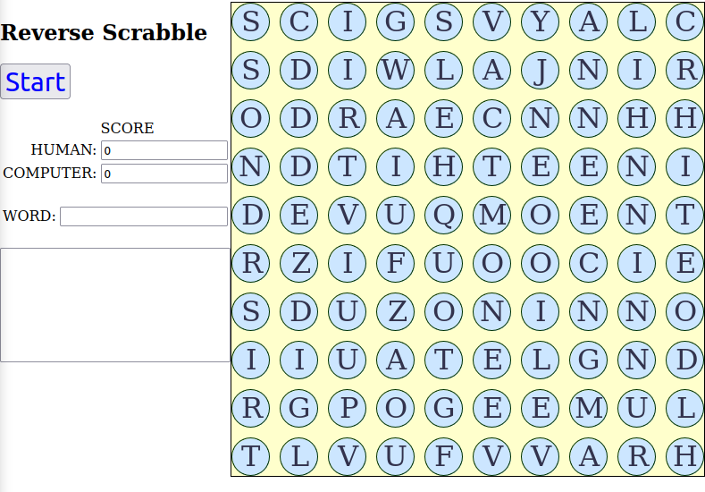

# Reverse Scrabble Game

Browser-based Javascript word puzzle.
Find words from a board of random letter tiles.

Scrabble(TM) is played by two players adding tiles to an empty board.
Reverse Scrabble is played by removing tiles.

A human player competes with the computer to find words with the highest scores.

Words are validated by comparing them to a lexicon based on a Unix/Linux dictionary.

 

All puzzles are generated as rectangular grids containing random letters.

## Getting Started
Download all of the files to a single directory, then open "index.html" in any browser that supports Javascript/ECMAscript.
The HTML file includes its supporting files from the current directory.

The dictionary (lexicon.json) is a JSON file of English words/clues organized as a trie.
New lexicons can be easily built using the gendict.py tool.

## License
None. Use the code freely.

## Overview of the project
- Version 0.01 (likely buggy!)
- Full-sized word puzzles
- Run completely in a modern browser
- Quick and easy to use
- Still under development...